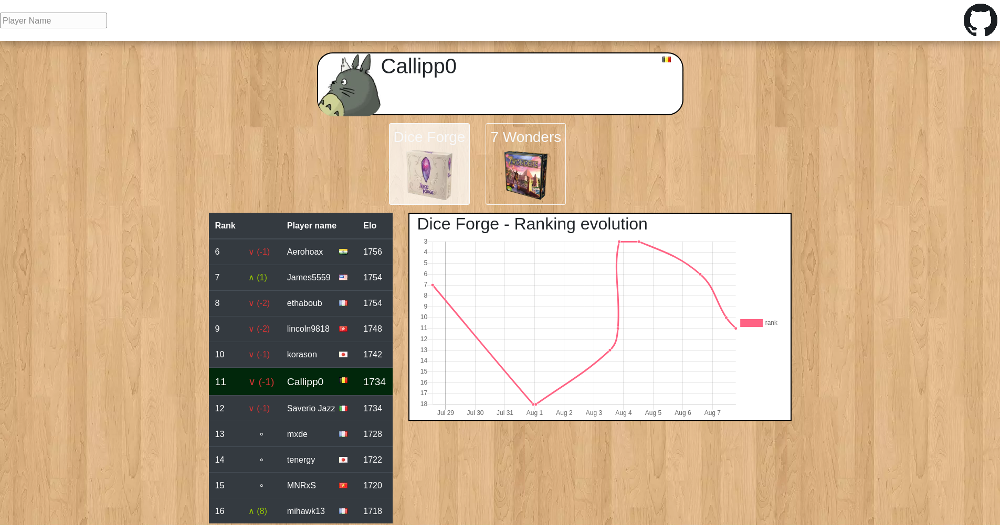
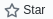

# BgaRankingsDashboard

## Context
BGA Dashboard offers a competitive view for [BoardGameArena](http://www.boardgamearena.com/) players.

[-> https://ymougenel.tech/bga](https://ymougenel.tech/bga)
 

If you enjoy the project, give it a  :smiley:

## Development 

1. Run [the backend](https://github.com/ymougenel/bga-dashboard-back ) (DB + springboot)

2. Run `npm start` for a dev server. 

Navigate to `http://localhost:4200/`. The app will automatically reload if you change any of the source files.

## Issues and feature

While using the project, if you encounter any bug or frustration, feel free to open an issue. 

It also applies to all the suggestion you have regarding some future enhancements :smirk:

## License
The project is under [Mozilla Public License (v2.0)](./License).
